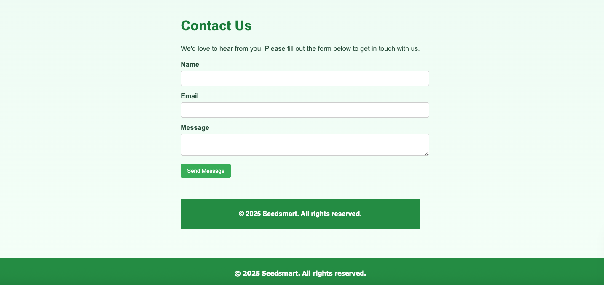

# Seedsmart 🌱
**Seedsmart** is an application to help gardening enthusiasts discover, research and learn about plants in an interactive way. Through a simple and visually appealing interface, the user can explore various plants, search for scientific names and get detailed information about them.

##Features
- 🌿 **Plant of the day**: Displays a different plant each day to inspire the user.
- 🔍 **Search by scientific name**: Search for plants using their scientific or common name.
- 🖼️ **Plant images**: Each plant includes an associated image for better identification.
- 📚 **Detailed information**: Each plant has a description and information about its scientific and common name.
- 😍 **Save is Favorite**: The user is able to save your favorites searches

## Deployed app:

[SeedsSmart](https://seedsmart-d89o.onrender.com/)

## Technologies Used
- **Frontend**:
- React.js
- TypeScript
-CSS
- Vite

- **Backend**:
- Express.js
- Apollo Server (GraphQL)
- MongoDB (for storing plant data)
- JWT (for user authentication)

- **APIs**:
- [Trefle API](https://trefle.io/) - Used to obtain detailed information about plants.

## ScreenShoots
<div>
  
  
  
  
  
  
</div> 

## Installation
### Prerequisites
- Node.js (recommended v16.x or higher)
- Git

### Steps
1. **Clone the repository**:

```bash
git clone https://github.com/bperdidoUCI/seedsmart
cd seedsmart
```

2. **Configure the .env file**:
Create a .env file in the root directory of both environments (frontend and backend) and add your environment variables. An example configuration can be found in the .env.example files of both directories.

3. **Frontend**:
API_KEY: Your Trefle API key (obtained from trefle.io)

4. **Backend**:
MONGODB_URI: URL to connect to MongoDB Atlas.
JWT_SECRET: Secret key for JWT authentication.

5. **Run app**:
```
bash
cd server
npm install

cd ..
cd client
npm install
npm run dev
```
Now you can access the frontend at http://localhost:3000 and the backend will be running on the GraphQL API at http://localhost:4000/graphql.

## Project Structure
The project is divided into two main directories:
client: Contains the frontend of the application, developed with React.
server: Contains the backend, including the Apollo Server configuration with GraphQL.

## Contributing
Fork the repository.

Create a new branch with your changes:

```
bash
git checkout -b your-branch-name
```

Add your changes and commit:
```
bash
git add .
git commit -m "Description of your changes"
```

Push to your repository:
```
bash

git push origin your-branch-name
Open a Pull Request in the original repository.
```

## License
This project is licensed under the MIT License - see the LICENSE file for more details.